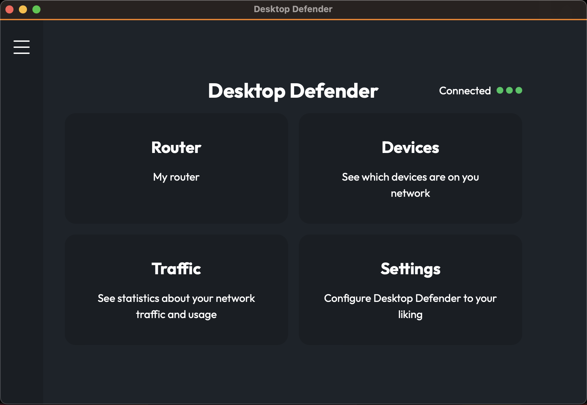

# Desktop Defender Setup Guide

Welcome to the setup guide for Desktop Defender. Follow the steps below to configure and start using the application.




## Installation Options
Desktop Defender can be installed using one of the following two methods:

### Manual Setup

You may choose to set up the application manually by following the detailed steps provided.


### Download from the Landing Page

For detailed steps on how to download and install Desktop Defender from the landing page, click [here](#setup-using-the-landing-page).


# Manual setup
## Prerequisites

- You need an API token from IPinfo to access geo-location services. Register at [IPinfo for Developers](https://ipinfo.io/developers) to get your API token.

## Configuration

1. **Set Environment Variable**:
   Store your API token as an environment variable to be used by the application. Open your terminal and run the following commands:
   ```bash
   export IPINFO_TOKEN="your_token_here"
   echo 'export IPINFO_TOKEN="your_token_here"' >> ~/.zshrc
   source ~/.zshrc
   ```
2. **Clone the Repository**:
    Clone the Desktop Defender repository to your local machine using the following command:
    ```bash
    git clone https://github.com/DesktopDefender/DesktopDefender.git
    ```
3. **Install Dependencies**:
    Change to the project directory and install the required Node modules:
    ```bash
    cd DesktopDefender
    npm install
    ```

## Usage
You can either run the application in a development environment or build it for production use.

## Running in Development
To run the application in development mode, execute:
```bash
npm run tauri dev
```

## Building for Production
To build the application for production, which compiles the application and adds to your machine:
```bash
npm run tauri build
```


### Persistence

#### Data Storage

When building Desktop Defender, a `.dd` directory containing SQLite databases is created within your home directory. This directory is used to store application data persistently.

#### Uninstalling

If you decide to uninstall Desktop Defender, please remember to manually remove the `.dd` directory to clean up all stored data. This step ensures that no residual data remains on your system.


# Setup using the Landing Page

You can download the application directly from the [Desktop Defender Landing Page](https://desktopdefender.app).

However since the binaries are yet to be signed the macOS gatekeeper adds a quarantine attribute downloads. You can remove this attribue by opening the terminal and typing the following command

```bash
xattr -cr /Applications/Desktop\ Defender.app
```